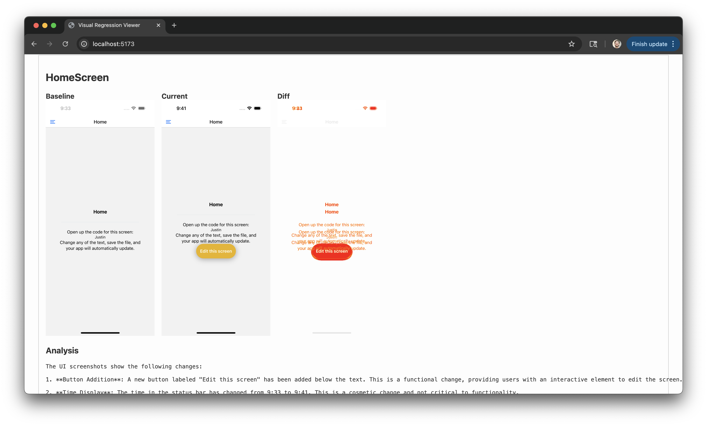

## Visual Regression Testing with AI, Maestro, and Expo:
---


---

## 📁 File Structure

```
visual-regression-cli/
├── maestro-flow.yaml
├── screenshots/
│   ├── *.png
│   └── diffs/
├── analyze.js
├── watchAndRun.js
├── .env
├── package.json
├── server.js             # Serves API + static screenshots
├── tsconfig.json         # Global for both backend and frontend
├── vite.config.ts        # Vite config for viewer
├── index.html            # Viewer HTML entrypoint
└── src/                  # React viewer
    ├── main.tsx
    ├── App.tsx
    └── App.css
```

---

## 🔐 .env

```
OPENAI_API_KEY=your-key-here
```

---
`rn-visual-regression` -> simple example Expo app scaffold (shoutout npx rn-new@latest aka Create Expo Stack):

---
# Test it yourself:
- add `OPENAI_API_KEY` in `rn-visual-regression/visual-regression-cli/.env`
- in `rn-visual-regression` directory:
  - `npm run ios` or `npm run android`
- in `rn-visual-regression/visual-regression-cli` directory:
  - `npm install`
  - `npm run start`
  - (you'll need concurrently, `npm i -g concurrently`)
- in `rn-visual-regression/maestro` directory:
  - notice the path in the `test.yaml`, make a change to app.
  - run `npm run test`
- watch the diff visualized/analyzed in the simple UI
- profit
